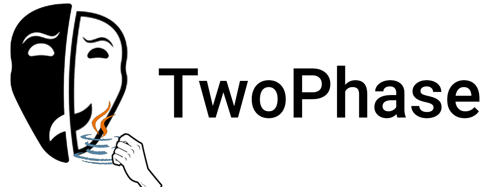
# TwoPhase - Two-phase commit protocol visualizer
TwoPhase is an illustration of the two-phase-commit protocol developed by three Computer Science-students from NTNU, Norway.
The project was made in the subject TDAT2004 Data Communications and Network Programming. 


## Table of contents
[[_TOC_]]


## Installation
To run the program you need to have java installed.
If you are using windows or a linux-based operating system you can run the following command in your command prompt /terminal:

```
java --version
```

If java is installed you will get something like this:

```
java 13.0.2 2020-01-14
Java(TM) SE Runtime Environment (build 13.0.2+8)
Java HotSpot(TM) 64-Bit Server VM (build 13.0.2+8, mixed mode, sharing
```

To download and install the program

```
git clone https://gitlab.stud.idi.ntnu.no/maxts/TwoPhase.git
```

To run the program you have to have (at least) two available terminals where one will play the role as the coordinator and the other terminals will play the role as a participant. 

From the terminal run the following command to compile the entire program

```
cd TwoPhase/src
javac *.java
```

To run the coordinator run the following command

```
java Coordinator
```

To run the participant run the following command

```
java Participant
```


## Usage

It's important to state that TwoPhase is supposed to be a illustration of distributed transactions using the two-phase commit protocol, and not an implimentation of the 
protocol itself. The goal is to illustrate atomic and destributed transactions, which either executes successfully at all participating nodes in the transaction, or 
doesn't execute at all. In order to simulate transactions, TwoPhase uses a money-transfer analogy, with money withdrawal- and depositoperations on one or more bank accounts. 

The coordinator will define the transaction, both its magnitude (it's amount) and nature (if it's a withdrawal or deposit). 

The participants will simulate bank-accounts on which the transactions will operate. 

This is however not money-wiring between two accounts, where one account transfers money to another account. The transaction submitted by the coordinator will be 
the same operation at all accounts. 

In order to visualize distributed transactions, we need sufficient nodes present, in the form of one coordinator and at least one participant.

When you compile and run Coordinator as shown in [Installation](#installation), it will ask you for the transaction amount. In order to simulate a withdrawal, specify a negative value, 
and in order to simulate a deposit, specify a positive value. After the transaction amount is specified, the user is free to initiate the transaction at any time by pressing
'Enter'.

As stated above, you also need at least one participating participant. Compile and run Participant as shown in [Installation](#installation). 

When you compile and run Participant, it will ask you to specify the bank-account's balance. Following the submittance of the balance is a choice whether you want the 
participant to be automatic or not. An automatic participant will, based on the transactions amount and the submitted balance, execute the protocol and make the right choices 
along the way. For example, if the transaction is to withdraw 800 NOK from an account with only 500 NOK, it will make the right decision and notify the coordinator that it's
unable to execute the transaction because of its insufficient funds. 

Simply put, you should choose the participant to be automatic if you want the protocol to run on it's own without user-interference. 

However, in order for TwoPhase to be able to simulate failing nodes in the transaction, we need to be able to manually guide some of the 
participants to make the "wrong" choices, or make them not answer at all. 

This can be achieved by submitting 'false' instead of true when the program asks for an automatic participant. The user will then have to review the transaction and 
submit whether the participant should prepare or abort. By submitting "PREPARED", you will notify the coordinator that you're ready to execute the transaction at that node. 
By submitting "NO", you will notify the coordinator that you're not ready to execute the transaction at that node.

By not submitting anything at this point, the user will simulate a failing node, and the coordinator will act thereafter. 

The user can then manually make every choice on the participant's
behalf, or choose not to answer at all. By doing this, you will simulate a crashing node. 

Whatever choice made previously in the program, you will reach a point where the coordinator will make a decision whether it should commit or abort the transaction. As the 
two-phase protocol dictates, the coordinator will then send its decision, and wait patiently for the participants' achnowledgements. If the user chose the participants to be 
automatic, they will automatically achnowledge this decision themselves by sending done. If the user specified the participants to be manual, he is expected to submit 'DONE'
on the participant's behalf. If he fails to do so, the coordinator will issue reminders to all participants which fail to acknowledge inside a given time frame. 


## Examples of usage
First, we initialize the coordinator. We say that the transaction value is -20 because we want to withdraw 20 from all Resource Managers. 


Thereafter, we initialize two particpants. We write false on both to run the participants manually. 

One of the participants will have an initial balance of 30 and the other 15. 

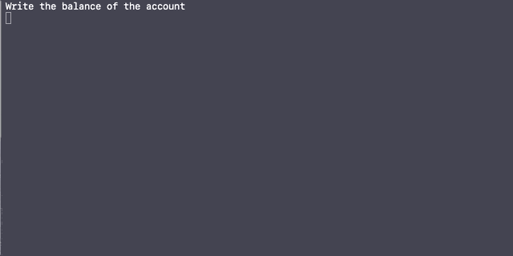 


The coordinator is now responsible for starting the protocol, and sends out REQUEST-TO-PREPARE to all participants.

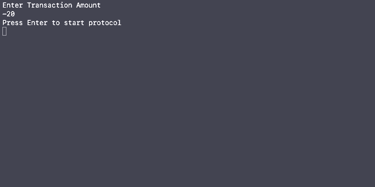

Both the participants will receive their REQUEST-TO-PREPARE, and will each send their own responses to the coordinator.

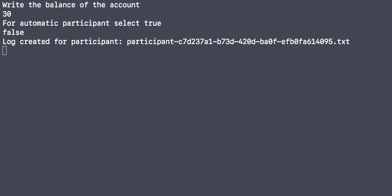
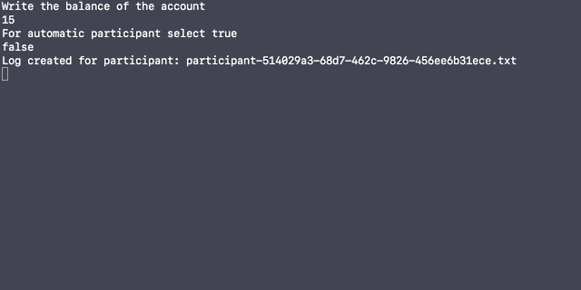

The coordinator will collect all of the responses, and then decide on whether to COMMIT or ABORT the transaction. It will then send its decision to its participants. 

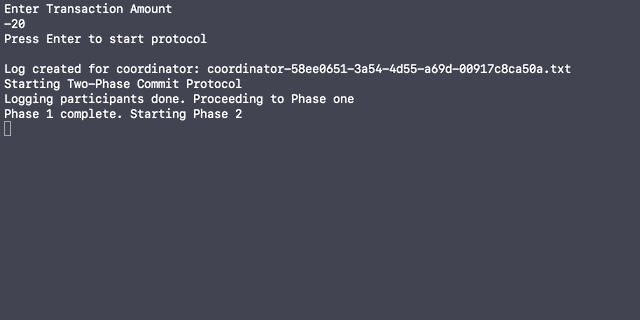

When the participants receives the decision they have to send an acknowledgment to the coordinator saying that they are DONE (have received the decision).

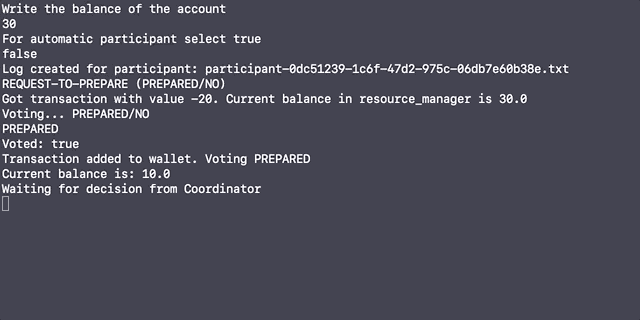
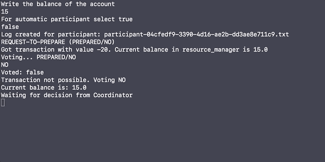

The coordinator will eventually finish when it has received DONE from all of its participants. 

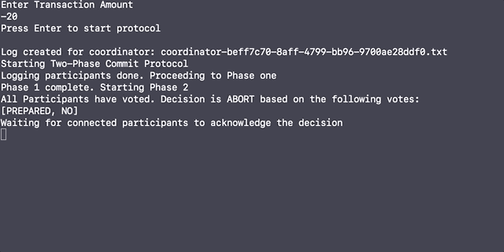


### Implementation and functionality

The implementation of the [two-phase commit protocol visualization](#twophase-two-phase-commit-protocol-visualizer) is illustrated in the UML class diagram below. All of the implemented classes with their respective 
object variables, constructors and methods are shown, as well as connectors between them which indicates interactions between the different classes. 

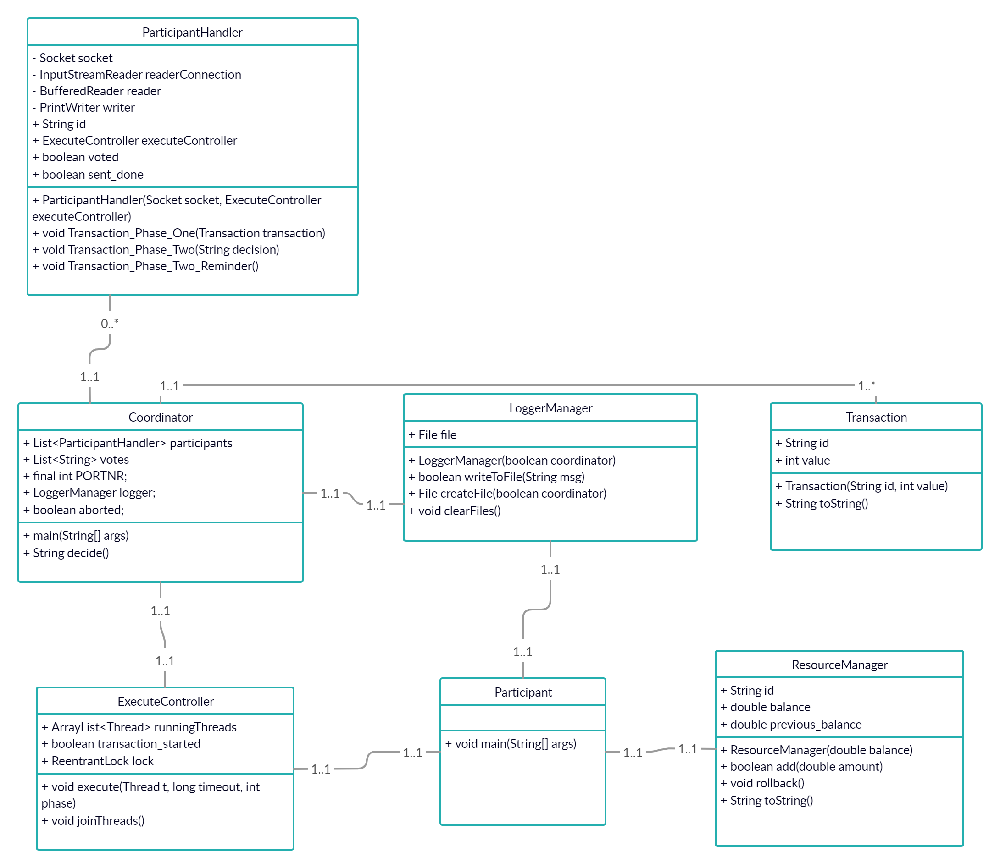

#### Core classes

The core classes in TwoPhase are the Coordinator, Participant and ParticipantHandler classes. The Coordinator and Participant classes symbolize a coordinator and 
participants present in distributed transactions. 


The communication between the three core classes is simplified (doesn't show threads), but is still illustrated in the UML sequence diagram below. 

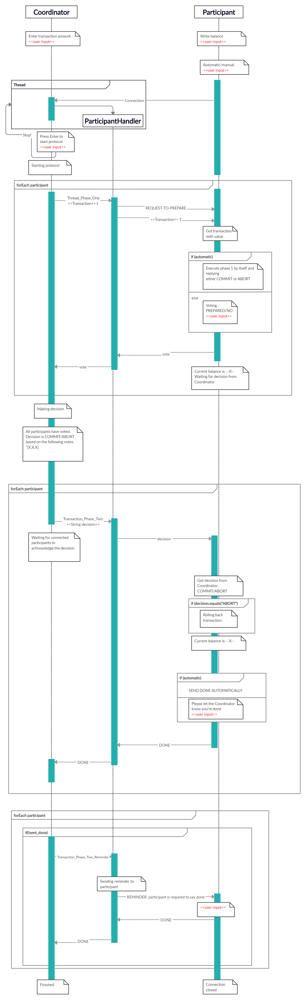

#### Coordinator

Coordinator keeps track of the transaction's participants and their respective votes as object variables, along with an instance of a LoggerManager in order to be able to 
log successfully during the execution of the protocol. 

The Participant and Coordinator classes connects via a Java Socket connection. In order to establish connections between several participants, Coordinator launches a thread 
who continously listens for any new connections to the ServerSocket. 
When a connection is established, the Socket-connection itself is sent as a parameter in the initiation of an ParticipantHandler-object. This class contains the phase 1 and 
phase 2 methods that makes up the essence in the two-face commit protocol. The ParticipantHandler-objects then get added to the participants-list. 

The rest of the Coordinator source code runs the two-phase protocol by printing lines, logging and making decisions. Coordinator launches phase 1 and phase 2 by 
iterating through the participants-list and making each and every participant call the 'Transaction_Phase_One' and 'Transaction_Phase_Two-methods' which are essential 
for the two-phase commmit procotol. Coordinator also provides a decide-method, used to make a desicion about whether it should commit or abort a transaction. This 
method iterates through the votes-list and checks whether any of the participants have voted "NO". If that's the case, it decides to abort. If not, it commits.

After the two phases, Coordinator waits for the DONE-achnowledgements from all the participants involved in the transaction. If any of them haven't acknowledged by replying 
"DONE", Coordinator issues a remainder. When all participants has acknowledged, Coordinator forgets the transaction by cleaning the lists and stops running. 

#### Participant

As previously stated, Participant connects to Coordinator via a Java Socket connection. In order to establish a channel for communications, Participant creates a
BufferedReader and a PrintWriter which allows the two parts to communicate by reading and writing messages. An ObjectInputStream is also initiated, 
and is used to recieve a Transaction-object. It also creates instances of the ResourceManager, LoggerManager and ExecuteController classes in order to manage 
resources, logging and handling timeouts.

When the transaction has started, Participant will read an object from the ObjectInputStream and parse it to a Transaction-object. Then, based on the "automatic/manual" 
user input, it either votes automatically or waits for the user to manually deicide on its behalf. It then writes its vote to Coordinator and waits for its decision. 
If the decision is to abort, Participant tells the ResourceManager to rollback the transaction. After the phase 2-decision, Participant has to acknowledge the Coordinator's 
decision by replying "DONE". Again, this is based on the "automatic/manual" user input, and can either be done manually or expect the user to type in "DONE". 
After the acknowledgement, Participant cleans up by closing all streams and connections. 


#### Participant Handler

The ParticipantHandler class works at Coordinator's behalf. It creates writer/reader objects based on the same connections as the Participants, so that the Coordinator will 
use a single instance of ParticipantHandler to handle each Participant. As previously stated, the ParticipantHandler provides the 'Transaction_Phase_One' and 'Transaction_Phase_Two'
methods which symbolizes the two phases in the two-phase commmit protocol. These methods are run by threads, in order to make every Participant-Coordinator relationship independent and execute in parallell (asynchronous).
ParticipantHandler also provides the 'Transaction_Phase_Two_Reminder' method which issues remainders to the Participants that fails to 
acknowledge the decision made by the Coordinator right away. 


### Functionality  

#### Logging

Even though the two-phase commit protocol could be visualized by the three core classes Participant, Coordinator and ParticipantHandler, additional classes had to be 
implemented in order to achieve a visualization to our satisfaction.

For the participants in the two-phase commit protocol to know what to do at recovery from failures, the protocol needs logging. In order to achieve this, we figured 
this would be logically handled by a LoggerManager class. This is a fairly simple class which has a File as an object-variable and methods for the creation and the
writing to the file. Each participant in the distributed transaction will be creating its own instance of a LoggerManager, and thus be provided an interface with which the 
participants can execute logging when necessary. 


#### Failure handling with timeouts

Most of the failing scenarioes for the protocol arises when one of the transaction's participants crashes, or the communication channel between participants fails, which
causes the messages to not be delivered. In both of these situations, the recipient won't respond right away. In the scenario in which the participant crashes, its recovery 
procedure may take a while, and if the message gets lost in its way it may never reply. By using timeouts we except the participants to notify each other within a given 
time frame, and if they don't, the transaction aborts. 

The timeouts are achieved by our ExecuteController class. This class keeps track of the TwoPhase's running threads in an ArrayList as an object-variable. The heart and soul 
of this class is the execute-method. This method takes a thread, timeout period, protocol-phase and a ParticipantHandler as arguments. It then proceeds to execute the thread, 
and waiting for the thread to die during the timeout-period. If the thread is still alive after the timeout-period, we know something's gone wrong, and based on the protocol-phase
in which the thread executes, it makes the actions necessary to make the transaction abort correctly. 

#### Resource Manager

We figured the best example of atomic distributed transactions were money-transfers at bank-accounts. A logical way to implement this was to have a ResourceManager class 
which acts as the bank-account itself, and provides an interface which allows the Participant to make small operations like adding and subtracting money or rollback. 
The class uses three object-variables; id, balance and previous_balance. When an instance of the class gets initiated, it gets assigned a random UUID and balance. Its
'add' method will add the amount of money given as argument, and will therefore by specifying a negative amount subtract this from the balance. 

#### Automatic/manual participants

In order to simulate failing nodes in a network during distributed transactions and thus be able to implement correct error-management, we needed to have a way to
manually take control of a participant and make it not respond. We did this by adding a choice for the user before the transaction begins. Here, the user chooses whether 
he wants the protocol to execute automatically by itself, or hen should be the one to make the choices during the protocol. 


## Choice of technologies and architecture

### Technologies

#### Programming language

Because Java is our main programming-language and has been since the start of our first year at NTNU, it was the most natural choice for us to be using Java. We had already 
solved some of the exercises in this subject by using Javas APIs, so we were familiar with Java's simple-to-use and powerful APIs like Thread, Socket and input/output-classes. 
Java is also one of the world's most widely used programming languages, so it's likely that when you're encountering a problem while programming, 
someone online has had the same problem you're facing, and thus making it likely you may find help online. 

It is also important to mention that Java is an object-oriented programming language. By thinking of everything as object it is easy to seperate the different tasks into logical classes. 
Therefore, we felt that Java was a very good fit to use for this project.


#### Connection TCP vs UDP

For the connection between the coordinator and the participants, we figured we had two choices, TCP or UDP, which are both important parts of this subject's syllabus.
As known, they're both protocols for sending packets of data over a network, but in different ways. TCP is all about reliability - packets sent with TCP are tracked 
so no data is lost or corrupted in transit, while UDP works similarly to TCP, but throws out all the error-checking stuff. This is therefore faster, so UDP is used when 
speed is desirable and error correction isn't necessary. 

Java offers socket-classes for both choices included in the net-package; Socket for TCP and the DatagramSocket for UDP. They're both pretty simple and intuitive to use. 

Because TwoPhase is supposed to illustrate distributed transactions with a money-transfering analogy, we figured the need for security and error-management outweighs the 
need for fast transfers. Because TwoPhase assumes the number of participants are within reason, we figured TCP are the better fit as the coordinator will have need 
for fewer, but more secure connections.


### Architecture

When we were presented with this project we started to read about the two-phase commit protocol right away, and quickly made up our minds regarding the design/architecture of 
[TwoPhase](#twophase-two-phase-commit-protocol-visualizer). Because the protocol revolves around two entities, a coordinator and one or more participants, we figured this was logical to implement as two classes, 
Coordinator and Participant. Coordinator of course had to be connected to the various participants, so we needed a way to make the participants 
connect to the coordinator. As previously stated, we went with a Java-Socket connection using TCP.

A significant component of our visualization is the ParticipantHandler class. In true object-oriented fashion, we decided to separate each participant-connection into 
separate objects. These objects contains their own connection-readers and writers as well as their own ExecuteController. We're also keeping track of different flags 
such as voted and done for each participant, and we´re also running each participant asynchronized in order to enhance the process.


## Further work
Since the project has a time limit, we didn't have time to implement all the features and optimizations we wanted. First and foremost we would love to make TwoPhase a standalone library, which can be used in any project. As our main goal was to visualize the Two-Phase Commit Protocol, we decided to focus on not creating a library, and instead keep it simple and easy to understand. Further we want a better thread management, to better control how our program is running. This would ensure not to overload the system if too many Participants are connected to the Coordinator. For example running each participant on their own personal thread instead of multiple, as well as closing threads the proper way.

Further we wanted to add some features that would bring the product to the next lever, such as transfer of coordination and multiple transactions queue. A multiple transaction queue would require us to complete the library, as stated above, this is a work in progress. For the multiple transactions to work, we need to create a queue for each transaction and lock each transaction to ensure that there will be no overlap between two transactions at any moment. Further we would also like to ensure that we can send specific transactions to specific ResourceManagers. However, since our system is not static this will be almost impossible. 

Transfer of coordination is one of the big, essential features we wanted to add. Since we are only visualizing one part of the entire system, it was unnecessary to develop this feature in the first prototype. However, when we will finish this library, this is an essential feature to scale TwoPhase for a multi-server system. 

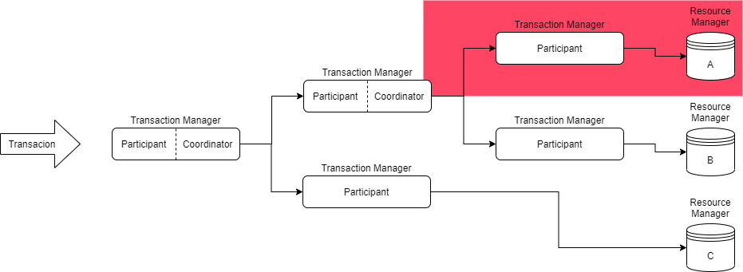

This chart is showing the flow of a single transaction through multiple Transaction Managers, which is both a Coordinator and a Participant. In TwoPhase we are only illustrating the pink section, since we are focusing on the protocol illustration and not mass scale development. However the implementation would be based on creating TransactionManager object on separate servers and creating connection conditions to create a true network of TransactionManagers. In our implementation all Participants are connected to the same Coordinator based on the local ip-address, however we could easily swap ports for each Coordination and have specific Participant connect to specific ports. 

## Documentation
JavaDoc is automatically generated and hosted <a href="http://maxts.pages.stud.idi.ntnu.no/TwoPhase/package-summary.html">her</a>.

## References
Bernstein, P. and Newcomer, E., 1997. Principles Of Transaction Processing. San Francisco: Morgan Kaufmann, chpt.9, pp.267-292. 

## Authors
<a href="https://gitlab.stud.idi.ntnu.no/maxts" target="_blank"></a>
<a href="https://gitlab.stud.idi.ntnu.no/simoaa" target="_blank"></a>
<a href="https://gitlab.stud.idi.ntnu.no/zuimran" target="_blank"></a>


